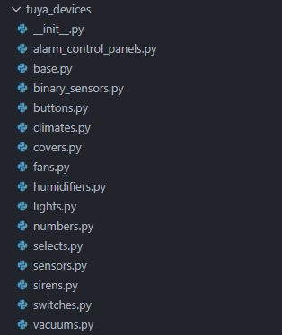

# Auto configure devices
Localtuya can disocver you device entities if cloud is enable because the feature at the moment rely on `DP code` and [Devices Category](https://developer.tuya.com/en/docs/iot/standarddescription?id=K9i5ql6waswzq#title-6-List%20of%20category%20code){target="_blank"}.

By known the `category` we use that to get all the possible entities from stored data.<br> Data stored in `/localtuya/core/tuya_devices` (1)
{.annotate}

1. Files named with entity type <br> <br> 

??? info "DPCodes data"
    All known `Codes` are stored in `base.py` in `DPCode Class`. <br>
    If class doesn't contains your `DPCode` Add it, `DPCode class sorted in alphabetically`.


!!! tip annotate "How to get the `Codes and DP`"
    You can download your devices data from HA using `Download diagnostics`

    1. Download device diagnostics `localtuya` from device page. (1) `file -> device_cloud_info`
    2. Download entry diagnostics `note: contains all devices data` (2) `file -> cloud_devices`

    Inside downloaded `txt file`, in `cloud_data object` look for your `device -> dps_data`

1. 
2. 

__Now that we know the device `category` and `Codes` we can start add the entities.__

In `/localtuya/core/tuya_devices` open the file named with `entity type` you want to add.<br>
All files contain `constant dict` contains all known `categories` (1).<br>
Look for the `category` modify if it existed then add the missing `entity`.
{.annotate}

1. e.g `COVERS or SWITCHES`

Using `LocalTuyaEntity class` we pass entity parameters `DPs Config name as keys and DPCode as values` Config names has to be supported by `localtuya` (1)
{.annotate}

1. All entities platforms has `id` config name. but some has more dp configs<br> For example: `cover platforms` has config names for `current_position_dp` and  `set_position_dp`<br> 

<!-- ???+ info "LocalTuyaClass Parameters"
    | Parameter                 |Required   | type          | Description
    |---------------------------|-----------|---------------|---------------------------
    |id                 |Yes        |DPCode         | The `code` entity ID usually 1st reported `DP`
    |name               |No         |string         | The `name` of the entity e.g `Power switch`
    |icon               |No         |string         | The `icon` of the entity e.g `mdi:power`.
    |entity_category    |No         |EntityCategory | The `category` of the entity e.g `EntityCategory.CONFIG`
    |device_class       |No         |DeviceClass    | The `device_class` of the entity if supported `depends on platform` e.g for switches `SwitchDeviceClass.OUTLET`
    |state_class        |No         |StateClass     | `state class` if entity supported e.g `SensorStateClass.MEASUREMENT`
    |custom_configs     |No         |dict           | Localtuya configs.

    #### Helpers
    | Parameter              | type                     | Description
    |------------------------|--------------------------|----------------------------------------------
    |condition_contains_any  |`#!py list[str,...]`      | If any string found in `DP` value will validate

    ??? tip "Platforms DP"
        ??? info "Covers"
            | Parameter                 | type   | Description
            |---------------------------|--------|---------------------------
            |current_state              |DPCode  | The code that wanted to use for current_state
            |current_position_dp        |DPCode  | The code that wanted to use for current_position_dp
            |set_position_dp            |DPCode  | The code that wanted to use for set_position_dp -->

# Examples 

??? example "Add `code: switch_4` into `SWITCHES` in `kg` category"
    ```python 
    "kg": (
        LocalTuyaEntity(
            id=DPCode.SWITCH_4, # REQUIRED: id config look for code `switch_4`
            name="Switch 4", # name the entity: `Switch 4`
            icon="mdi:icon_name",  # icon of the entity
            entity_category=EntityCategory.CONFIG, # show entity in this category
        ),
    ),
    ```

??? example "Add `switch` into `SWITCHES` in `cl` category: with condition"
    ```python 
    "cl": (
        LocalTuyaEntity(
            id=DPCode.CONTROL_BACK,
            name="Reverse",
            icon="mdi:swap-horizontal",
            entity_category=EntityCategory.CONFIG,
            condition_contains_any=["true", "false"],
        ),
    ),
    ```


??? example "Add `cover` into `COVERS` in `cl` category"
    ```python 
    "cl": (
        LocalTuyaEntity(
            id=DPCode.CONTROL,
            name="Curtain",
            custom_configs=localtuya_cover("open_close_stop", "position"), # localtuya config
            current_state=DPCode.SITUATION_SET,
            current_position_dp=(DPCode.PERCENT_CONTROL, DPCode.PERCENT_STATE),#(1)!
            set_position_dp=DPCode.PERCENT_CONTROL,
        ),
    ),
    ```

    1. current_position_dp will search two possible codes and will take the first `DP` found.


